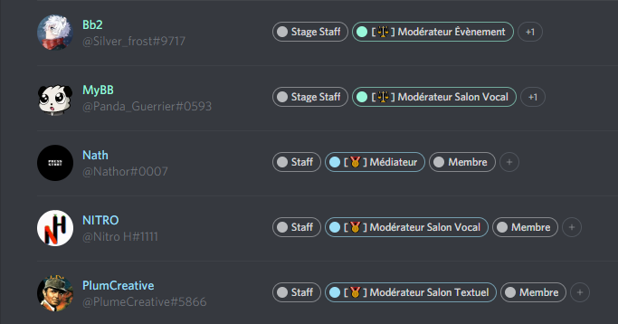
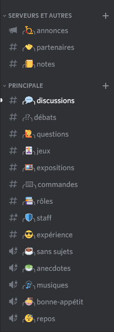
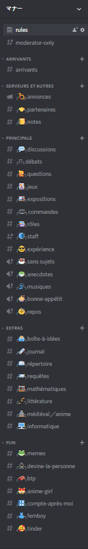
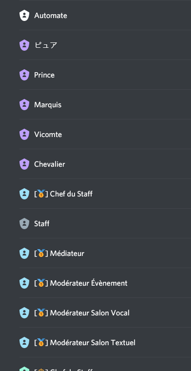

 
    <a style='padding: 0 2%;' href='https://discord.gg/wajHZeNM'>Discord/</a>    <a style='padding: 0 2%;' href='#list'>Equipe/</a> 
    <h2> Présentation   📃 </h2>

    
     <strong style = 'font-size: 150%;'> マナー </strong>
    <h3><strong> 🏛 Les salons 🏛 </strong></h3>
    
<em> Il s'agit d'un serveur multi-taches, autrement dit vous-y trouverez des salons et la communauté sur des différentes thèmes: L'études, comme la mathématique et informatique. La détente, comme dans la section FUN, avec de multiples salons, de jeux, et memes. Enfin la section PRICIPALE ou vous trouverez le salon #générale, #débats et des salons concernant le serveur. De naumbreux salons seront ajouté, en fonction de la demande et les votes efectués dans le salon #boîte à idées et/ou #débats ^^. </em> 🏗 🏙 

    

        
        
    

    <h3><strong> 🐱‍👤 Les rôles 🐱‍👤</strong></h3>
    
<em> Le serveur possède beaucoup de rôles, en tout 3 grands groups, les rôles plantes que vous obtenné, à partire de {100 > +}, puis les rôles des signes, qui sont disponible à partire de {1000 > +} et enfin les arc-en-ciel pour les membres très amplique et actives. Plus d'informations dans le salon #rôles, d'édiés exprès pour vos questions concernant leurs évolution. </em> 😁 💪🏻 

    
    <h3><strong> 🧾 Les règles 📜 </strong></h3>
    
<em> Les règles ne sont pas si compliquées, il faut juste être poli et être respectueux avec les autres, aider les personnes en difficultés, respecter les thèmes de chaque salon, donner votre avis et vos idées constructivement et participer à rendre le serveur le meilleur possible ^^ ! </em> En rejoignent le serveur vous rejoigné une famille, que vous amélioré:
    - Des règles particulières sur les grands mots: insulte = mute(3h), cependant les modérateurs doivent faire attention au contexte, pour rester le plus correcte possible, de même si un modérateur fais mal son boulot, vous pouvez le signalé au président, soit le créateur du serveur.

    <h2 id='list'><string> 🤓 L'équipe & Créateurs 😎 </string></h2>
    <ul style='list-style: none;'>
        <li> NITRO :  [🥇] Modérateur Salon Vocal</li>
        <li> MyBB :  [⚖️] Modérateur Salon Vocal</li>
        <li> PlumCreative :  [🥇] Modérateur Salon Textuel</li>
        <li> Nath :  [🥇] Médiateur</li>
        <li> ♔ Luca :  [🥇] Chef du Staff (de même que créateur du serveur)</li>
    </ul>

</body>
